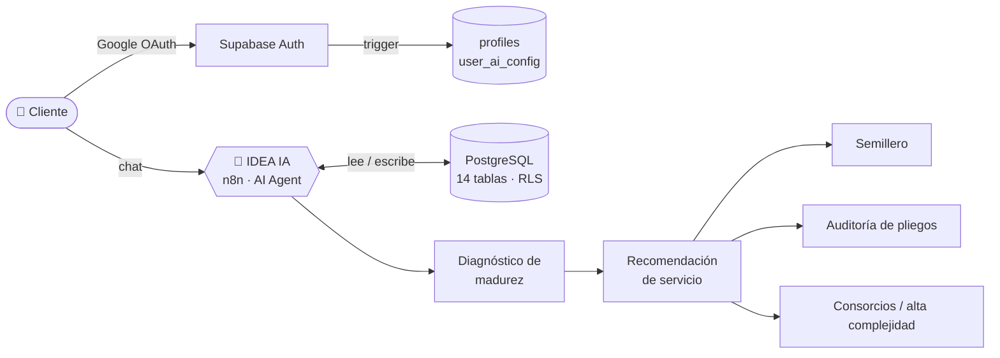

<!-- Perfil de GitHub · toriikarii (jdmahecha1) -->
<div align="center">


<a href="https://git.io/typing-svg">
  
</a>

<p>
  
  
  
</p>

</div>

---

## 👨‍💻 Sobre mí

Estudiante de **Ingeniería de Sistemas** en la Universidad Santo Tomás (Tunja). Me gusta convertir problemas de negocio en sistemas que funcionan: modelo los datos, los protejo y les pongo una capa de IA encima.

- 🗄️ Diseño **bases de datos relacionales** en Supabase / PostgreSQL: modelado, políticas **RLS**, *triggers* y autenticación con **Google OAuth**.
- 🤖 Construyo **agentes de IA** y flujos de automatización en **n8n**.
- 🌐 Empecé por el **desarrollo web** (HTML, CSS y JavaScript) y de ahí salté al backend.
- 🧠 Trabajo con **IA como herramienta de desarrollo** (Claude + MCP) para diseñar, documentar y depurar más rápido.
- 🎯 Abierto a **prácticas** y proyectos **freelance** de bases de datos, backend o automatización con IA.

---

## 🚀 Proyecto destacado · IDEA IA

> Agente de IA para **IDEAPRO S.A.S.**, consultora que asesora a empresarios colombianos en **contratación pública y licitaciones** (SECOP, RUP, Colombia Compra Eficiente).

**El problema:** cada cliente llega con un nivel de experiencia distinto y necesita un servicio distinto.
**La solución:** un agente que conversa con el cliente, **diagnostica su nivel de madurez** y le recomienda el servicio adecuado, recordando el contexto entre conversaciones.

| | |
|---|---|
| 🧩 **Base de datos** | 14 tablas en PostgreSQL (Supabase) con **RLS habilitado en todas** |
| 🔐 **Autenticación** | Login con Google; un *trigger* sobre `auth.users` crea el perfil y la configuración del agente en el primer inicio de sesión |
| 🧠 **Memoria** | Memoria de largo plazo **por usuario** y configuración del agente individual, no global |
| 📊 **Diagnóstico** | Niveles de madurez, preguntas, sesiones y respuestas → recomendación de servicio |
| ⚙️ **Orquestación** | Nodo *AI Agent* en **n8n** conectado a la base de datos |



<sub>Stack: Supabase · PostgreSQL · SQL · n8n · Google OAuth</sub>

---

## 🛠️ Tecnologías

**Datos & Backend**<br/>


**IA & Automatización**<br/>


**Web**<br/>


**Herramientas**<br/>


---

## 📂 Otros proyectos

| Proyecto | Descripción | Stack |
|---|---|---|
| [**Deportes GGM**](https://github.com/jdmahecha1/deportesggm.github.io) | Sitio web multipágina sobre la vida deportiva de un colegio: fútbol, logros, juegos, ubicación y contacto. | `HTML` `CSS` `JavaScript` |

---

## 📈 En qué estoy ahora

```yaml
construyendo: IDEA IA — memoria de largo plazo, seguimientos y registro de eventos del agente
documentando: el diseño de la base de datos de IDEA PRO y el porqué de cada decisión
estudiando:   Ingeniería de Sistemas @ USTA Tunja (álgebra lineal, fundamentos)
```

---

## 📫 Contacto

<p>
  <a href="https://github.com/jdmahecha1"></a>
  <a href="mailto:dm901919@gmail.com"></a>
</p>

<div align="center">

</div>
